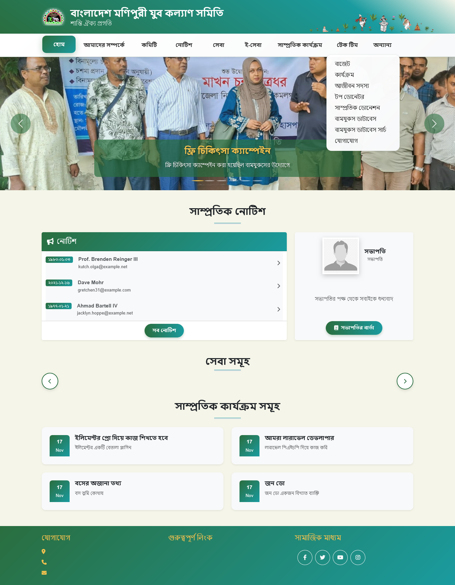
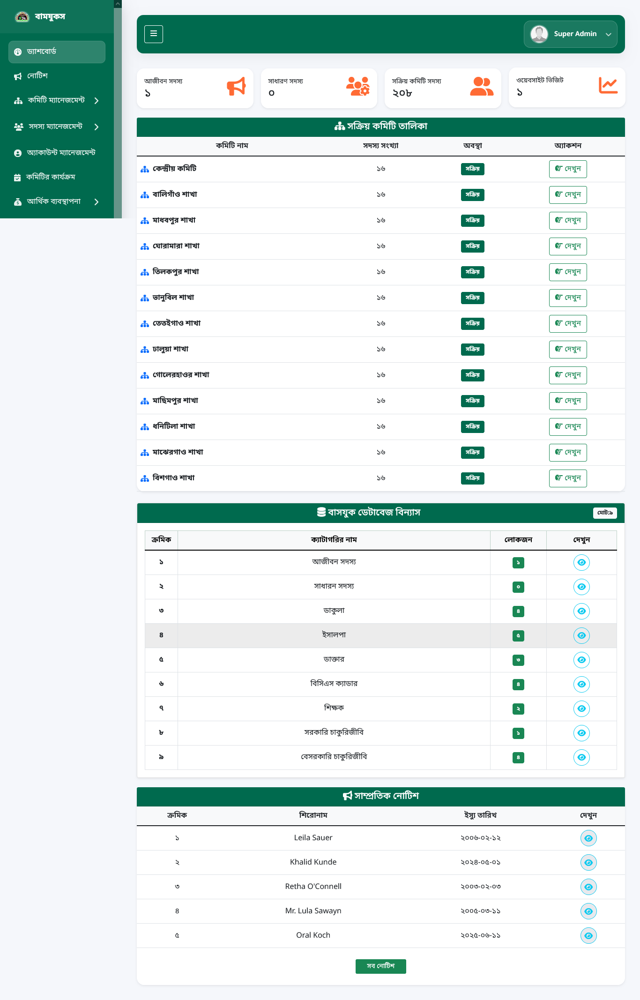
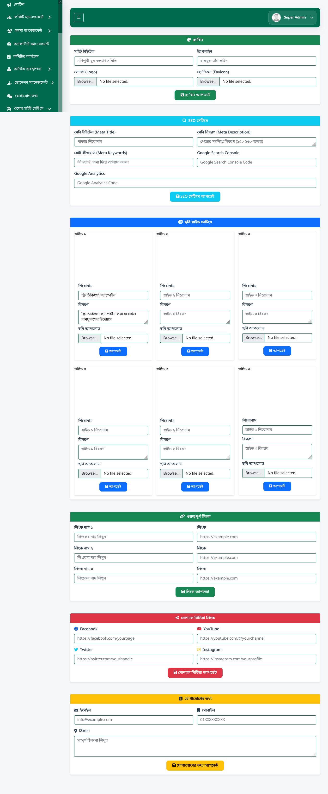

# 📝 BAMJUKS - Advanced Organization & Multi-Committee Management System

[](https://demo.mcqbankbd.com)
[](https://demo.mcqbankbd.com/dashboard)

**BAMJUKS** is a robust, feature-rich management platform built with the Laravel framework. It is specifically designed to streamline organizational operations through multi-committee management, dynamic memberships, financial auditing, and integrated blogging.

---
## 🌟 Core Modules & Features

### 1. Multi-Committee Architecture & Authorization
- **Independent Committee Accounts:** Dedicated login and authorization for each committee.
- **Role-Based Access Control (RBAC):** Granular permissions ensuring committees only access their assigned data.
- **Dynamic Committee Management:** Create, update, and manage various committees from a centralized admin panel.

### 2. Member Management & Advanced Search
- **Dynamic Profiles:** Independent member record management for each committee.
- **Multi-Parameter Search:** Filter members by Name, Parents' Name, Address, Contact, and **Blood Group**.

### 3. Financial & Donation Module
- **Decentralized Finance:** Independent financial ledgers and transaction history for each committee.
- **Donation Tracking:** Sophisticated module to manage, track, and report organization-wide donations.
- **Expense Management:** Automated tracking of committee-specific expenditures.

### 4. Integrated Content Management
- **WordPress Blog Integration:** Hybrid setup with a WordPress blog attached via subdirectory/proxy.
- **Collaborative Posting:** Authorized members can publish blog posts and stories directly.
- **Notice Board:** Dynamically issue official notices and announcements.

### 5. Dynamic Global Settings
- **Site Configuration:** Total control over site identity (Logo, Contact Info, Social Links, Meta Data).

---

## 🛠 Technical Stack 

| **Layer** | **Technology** |
| :--- | :--- |
| **Backend** | PHP 8.x, Laravel Framework |
| **Frontend** | Blade Templating, Bootstrap |
| **Database** | MySQL |
| **Blog Engine** | WordPress (Attached via Subdirectory/Proxy) |
| **Authentication** | Laravel Middleware(Customized) |

## 🛡 Security Features

   - **CSRF Protection:** Secure form submissions.
   - **SQL Injection Prevention:** Eloquent ORM used for all database interactions.
   - **Secure Authentication:** Hashed passwords and session-based security.
---
---
## 📂 Project Structure & Architecture 

The system follows a modular architecture to handle multi-committee operations and decentralized data management efficiently.

 ### Routes & Navigation (Endpoint Mapping)

   - **Central Admin Routes:** Global control over committee creation, site configuration, and system-wide audit logs.
    - **Committee Dashboard:** Independent workspace for authorized committee members to manage their specific branch.
   - **Dynamic Search Routes:** Endpoints dedicated to multi-parameter filtering (Blood Group, Location, Name).
   - **Public & Blog Hub:** Seamless integration between the Laravel frontend and the proxied WordPress blog.

 ### Models & Database Schema

   - **Committee:** Manages independent accounts, login credentials, and specific authorization tokens.
   - **Member:** Stores granular profile data (Personal Info, Contact, Blood Group, and Committee Mapping).
   - **FinancialLedger:** Handles decentralized income/expense tracking and real-time balance calculations.
   - **Donation:** Tracks donor history, amounts, and specific project-based contributions.
   - **Notice:** Stores dynamic announcements and committee-specific official notifications.
   - **Setting:** Stores global site identity (Logo, Meta-tags, Social Links) in a dynamic key-value pair.

 ### Authorization & Middleware

   - **MultiCommitteeAuth:** A custom middleware ensuring committee data isolation (preventing cross-committee data access).
   - **RolePermissionManager:** Handles Granular RBAC, ensuring only authorized roles can issue notices or modify financial records.

 ### Services & Logic Layers 

   - **AdvancedSearchService:** A dedicated engine for high-performance filtering across multiple parameters like Blood Group and Location.
   - **FinanceEngine:** Logic for automated transaction processing, audit trail generation, and financial reporting.
   - **WordPressBridge:** Manages the hybrid connectivity between Laravel and the WordPress blogging ecosystem.

 ### Frontend & UI Components

   - **Admin Command Center:** A comprehensive dashboard for high-level organizational oversight.
   - **Committee Workspace:** A clean, focused UI for managing daily committee-specific operations.
   - **Dynamic Settings Panel:** An intuitive interface for non-technical admins to update site branding and contact info.
---
---

## 📸 Interface Preview

### 🏠 Landing Page (Homepage)


### 🖥️ Dashboard & Management Modules
<table>
  <tr>
    <td width="50%">
      <b>📊 Admin Dashboard</b>
      <br>
      
    </td>
    <td width="50%">
      <b>⚙️ Dynamic Settings</b>
      <br>
      
    </td>
  </tr>
</table>

---

---
## 🚀 Setup Instructions

1. **Clone the repository**
```bash
git clone https://github.com/dev-roni/bmjks-org.git
```
2.**Open/Enter to project folder**
cd bmjks-org

3.**Install all dependencies**
```bash
composer install
```
4.**.env file setup**
Generate a .env file using .env.example
```bash
copy .env.example .env
```
Set database name (DB_DATABASE=bmjks)

5.**Generate Application Key**
```bash
php artisan key:generate
```
6.**Configure environment**

create a MySQL database named "bmjks"

Set queue driver (QUEUE_CONNECTION=database recommended)

7.**Run migrations**
```bash
php artisan migrate
```
8.**Seed initial data**
```bash
php artisan db:seed
```
10.**link storage to access file**
```bash
php artisan storage:link
```
10.**Start development server**
```bash
php artisan serve
```
Access the project at http://127.0.0.1:8000

11.**Queue Worker Setup**
```bash
php artisan queue:work
```
Make sure QUEUE_CONNECTION in .env is set to database or another supported driver.

---
---
## 🔐 Default Credentials

After setting up the project, you can log in to the admin panel with the following information:


| Role | User Name | Password |
| :--- | :--- | :--- |
| **Super Admin** | `bmjkssuperadmin` | `12345678` |
| **Cashier** | `Cashier` | `12345678` |
| **CentralAdmin** | `bmjkscentraladmin` | `12345678` |

> [!IMPORTANT]
> Be sure to change these passwords after hosting the project in a production environment.

---
